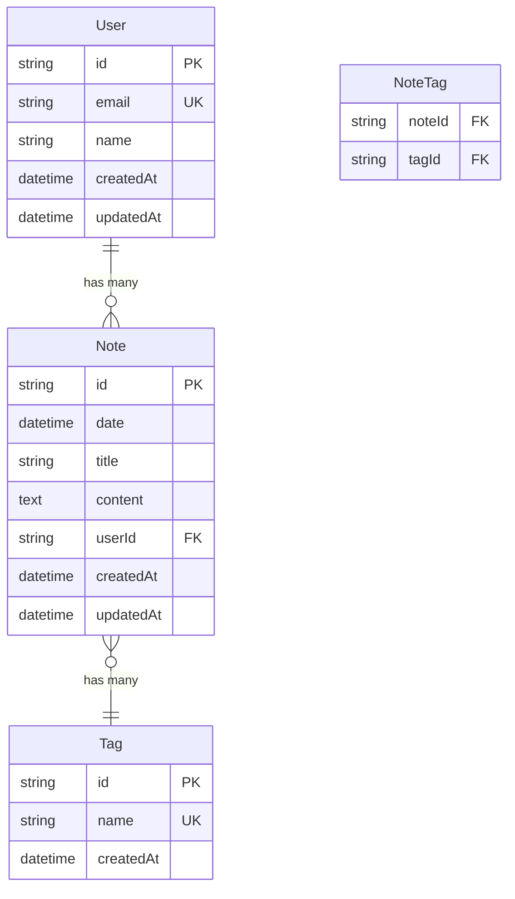

# 技術アーキテクチャ

## システム構成図

```
┌─────────────────┐     ┌─────────────────┐     ┌─────────────────┐
│                 │     │                 │     │                 │
│   Browser       │────▶│    Vercel       │────▶│     Neon        │
│   (Client)      │◀────│    (Remix)      │◀────│  (PostgreSQL)   │
│                 │     │                 │     │                 │
└─────────────────┘     └─────────────────┘     └─────────────────┘
```

## 技術スタック詳細

### フロントエンド

- **フレームワーク**: Remix v2.16.8
- **言語**: TypeScript (strict mode)
- **スタイリング**: Tailwind CSS v3.x
- **UIコンポーネント**: shadcn/ui (Radix UI + Tailwind)
- **状態管理**: Remix built-in (loader/action)
- **フォーム**: Remix Form
- **バリデーション**: Zod

### バックエンド

- **ランタイム**: Node.js v22.17.0
- **フレームワーク**: Remix (SSR)
- **ORM**: Prisma v6.11.1
- **認証**: Remix Auth (将来実装)
- **セッション**: Cookie-based

### データベース

- **DBMS**: PostgreSQL 15
- **ホスティング**: Neon (Serverless)
- **マイグレーション**: Prisma Migrate
- **接続プール**: Neon Pooler

### インフラ

- **ホスティング**: Vercel
- **CDN**: Vercel Edge Network
- **環境変数**: Vercel Environment Variables
- **CI/CD**: GitHub Actions + Vercel

### 開発環境

- **パッケージマネージャー**: pnpm v10.12.4
- **コードフォーマッター**: Prettier
- **リンター**: ESLint
- **Git hooks**: Husky (将来設定)
- **コンテナ**: Dev Container

## データモデル



## ディレクトリ構造

```
job-diary-remix/
├── app/
│   ├── components/        # 再利用可能なコンポーネント
│   │   ├── ui/           # shadcn/uiコンポーネント
│   │   ├── calendar/     # カレンダー関連
│   │   ├── editor/       # エディター関連
│   │   └── layout/       # レイアウト関連
│   ├── lib/              # ユーティリティ
│   │   ├── prisma.ts     # Prismaクライアント
│   │   ├── utils.ts      # 汎用ユーティリティ
│   │   └── validations/  # Zodスキーマ
│   ├── routes/           # Remixルート
│   │   ├── _index.tsx    # トップページ
│   │   ├── notes/        # 日記関連ページ
│   │   └── api/          # APIエンドポイント
│   ├── styles/           # グローバルスタイル
│   └── root.tsx          # ルートコンポーネント
├── prisma/
│   ├── schema.prisma     # データベーススキーマ
│   └── migrations/       # マイグレーションファイル
├── public/               # 静的ファイル
├── docs/                 # ドキュメント
│   └── adr/             # Architecture Decision Records
└── tests/               # テストファイル（将来）
```

## セキュリティ設計

### 認証・認可

- セッションベース認証（Cookie）
- CSRF保護（Remix built-in）
- セキュアなCookie設定（httpOnly, secure, sameSite）

### データ保護

- HTTPS必須
- 環境変数による機密情報管理
- Prepared Statements（Prisma経由）

### 入力検証

- サーバーサイドバリデーション（Zod）
- XSS対策（React自動エスケープ）
- Content Security Policy設定

## パフォーマンス最適化

### フロントエンド

- Code Splitting（Remix自動）
- Prefetching（Remix Link）
- 画像最適化（将来実装）
- Web Vitals監視

### バックエンド

- データベースクエリ最適化
- N+1問題の回避（Prisma include）
- キャッシュ戦略（HTTP Cache Headers）

### データベース

- インデックス設計
- コネクションプーリング
- クエリ最適化

## 開発フロー

1. **ローカル開発**
   - Dev Containerで環境構築
   - pnpm devで開発サーバー起動
   - Prisma Studioでデータ確認

2. **テスト**（将来実装）
   - Unit Test（Vitest）
   - Integration Test
   - E2E Test（Playwright）

3. **デプロイ**
   - GitHubへpush
   - Vercelが自動ビルド・デプロイ
   - プレビュー環境で確認
   - 本番環境へマージ
